## TASCA 02 DPR: còpies de seguretat. Cas pràctic

**Per començcar afegirem el Disc Secundari de 10 GB**

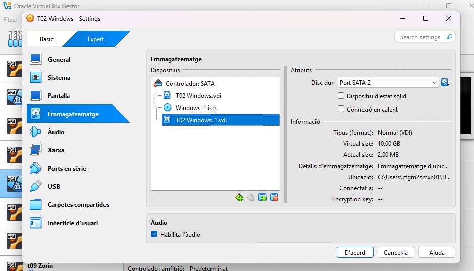

**A dins de la màquina obrirem l'administrador de discos i farem click dret sobre ell, li donarem a siguiente fins que quedi així**

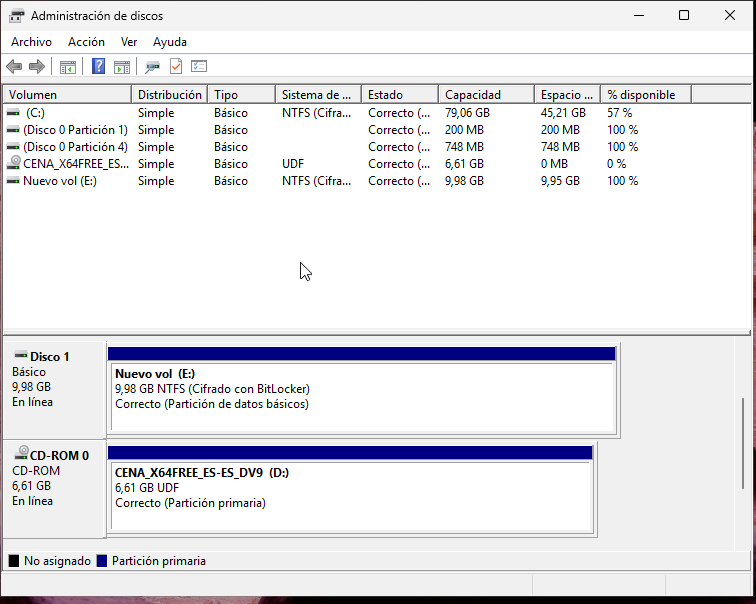

**Ara crearem documents per fer les proves de copa de seguretat**

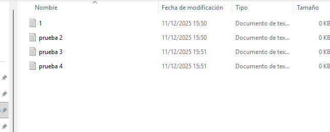


**El primer pas serà entrar al nostre navegador i entrar a la Web de duplicati, seguidament instal·larem segons el nostre sistema operatiu, en aquest cas Windows**


**Un cop instal·lat obrim el descarregable i començem amb la instal·lació**


**Acceptem y continuem**


**Seguim amb la instal·lació com a les següents captures**


**Haurem de donar-li permisos per fer canvis al dispositiu**


**Esperem a que es completi**


**Un cop completat, li donarem a Finish**


**Al donar-li a finish ens obrirà una pàgina al nostre navegador, podrem canviar la contrasenya, però en aquest cas no la canviarem**


**Afagirem un backup**


**Ara posarem la informació del disc**


**Posarem que el backup es fagi al disc secundari**

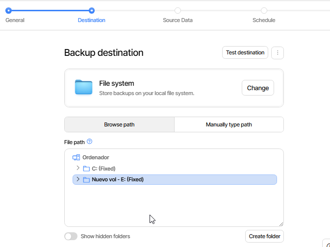


**El següent serà seleccionar el que volem que es fagi un backup, en aquest cas seran els 4 documents que hem creat abans**

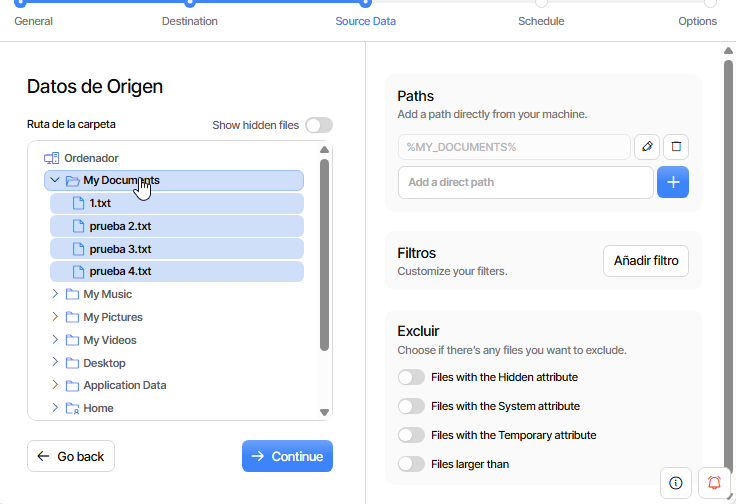

**Posarem que es fagi cada 1 hora**


**Per últim li donarem a Submit i ja estarà creat**

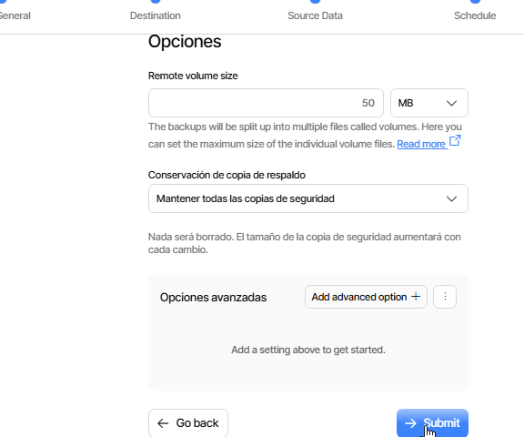


**Ara farem el mateix pero amb Google Drive**

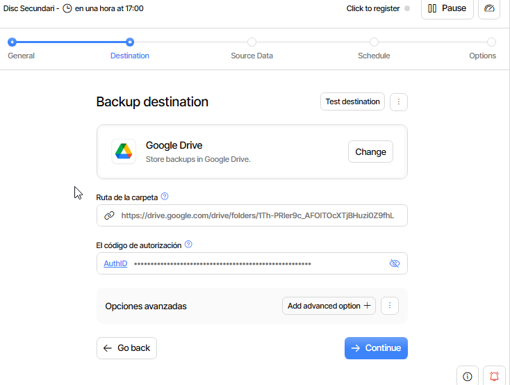

**La farem cada dia a les 6 de la tarda**

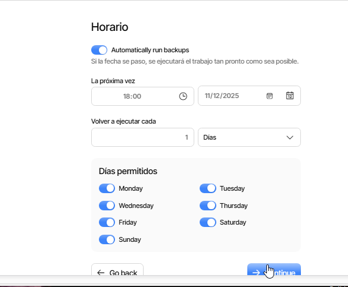


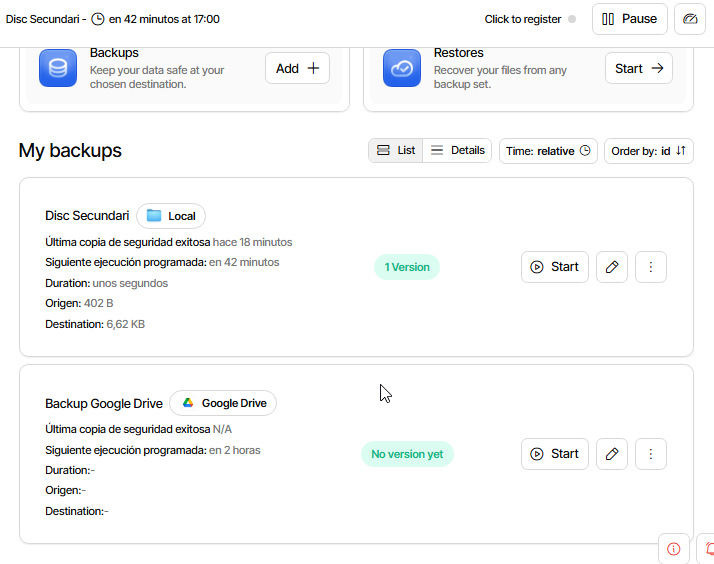


**Ara borrarem els documents per veure si es fa el backup**

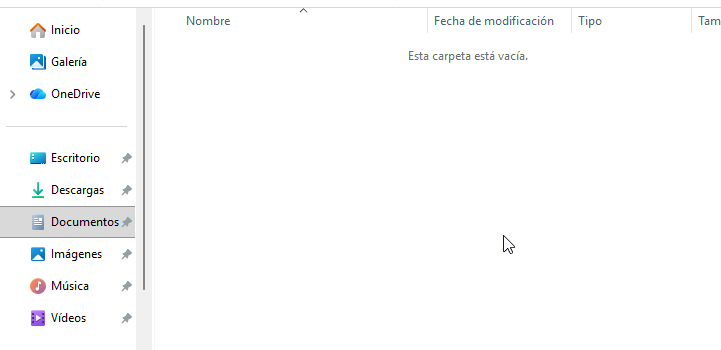

**Anirem a Restore a la part esquerra i despres farem click a restore i start**

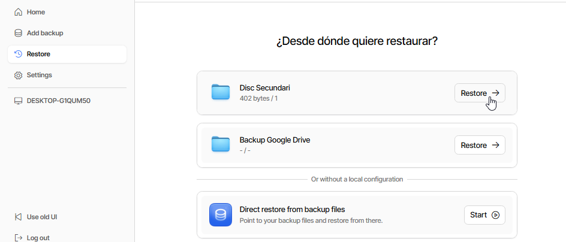

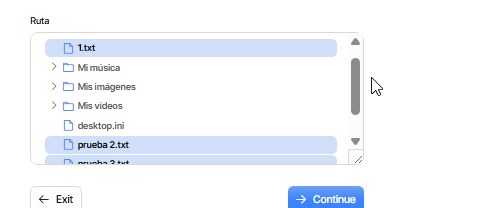

**Ja ho tindriem fet**

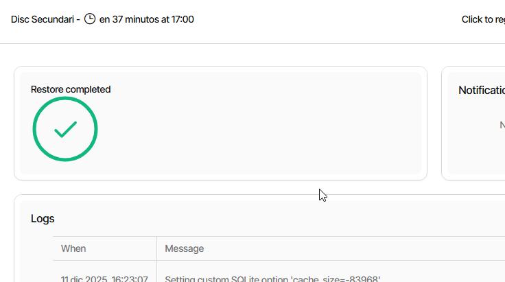

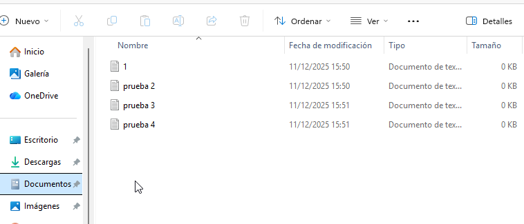


**Ara pasarem a la part de Ubuntu**

**Farem servir Duplicaty**

**Primer de tot farem la següent comanda**

```
mkdir /media/backup 
```

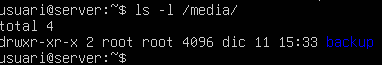

**Ara haurem de donar-li forma al disc**

```
sudo apt install fdisk
```

**Ara veurem el disc que tenim**

```
fdisk -l
```

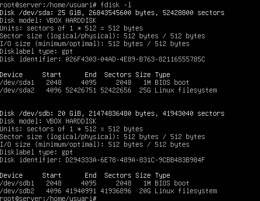

**Ara haurem d'instal·lar lvm2**

```
sudo apt install lvm2
```

**I ara crearem el volum**

```
pvcreate /dev/sdb
```

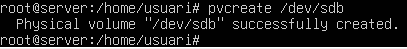

**El següent pas serà formategar-lo**

```
mkfs.xfs -f /dev/sdb
```

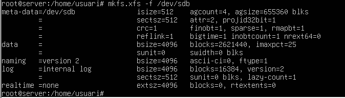

**Ara muntarem el disc a la carpeta que hem creat abans**

```
mount /dev/sdb /media/backup
```

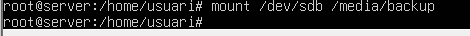

**Ara instal·larem el Duplicity**

```
apt install duplicity -y
```

**Un cop tinguis això llest, el següent pas és crear un parell d’usuaris amb la seva carpeta personal i posar quatre arxius de 10 MB al home del teu usuari.**

```
useradd -m -s /bin/bash user1
```

```
useradd -m -s /bin/bash user2
```

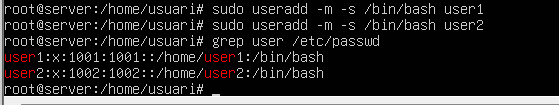

```
fallocate -l 10MB file1
fallocate -l 10MB file2
fallocate -l 10MB file3
fallocate -l 10MB file4
```

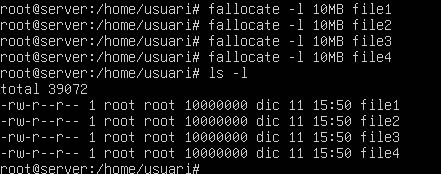

**Ara ja tenim els arxius creats, amb la següent comanda fem una copia de seguretat a la carepta home**

```
duplicity full /home/user file:///media/backup/
```

**Jo he escollit la passphrase prova1**

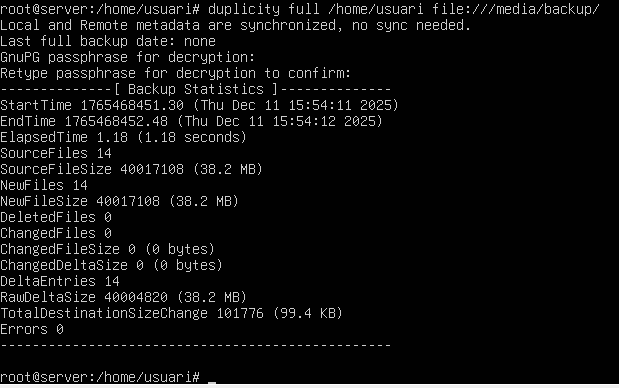

**Amb la comanda ls podem veure que s'ha fet**

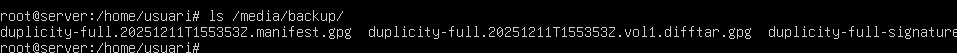

**Ara borrarem els documents que hem fet abans**

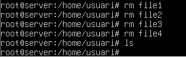

```
duplicity restore file:///media/backup/ /home/user/copia
```

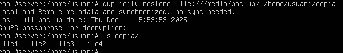


**Ara farem una copia incremental, per això farem un arxiu**

```
fallocate -l 4MB file5
```

**Ara tornem a fer la copia amb la comanda de la imatge següent**

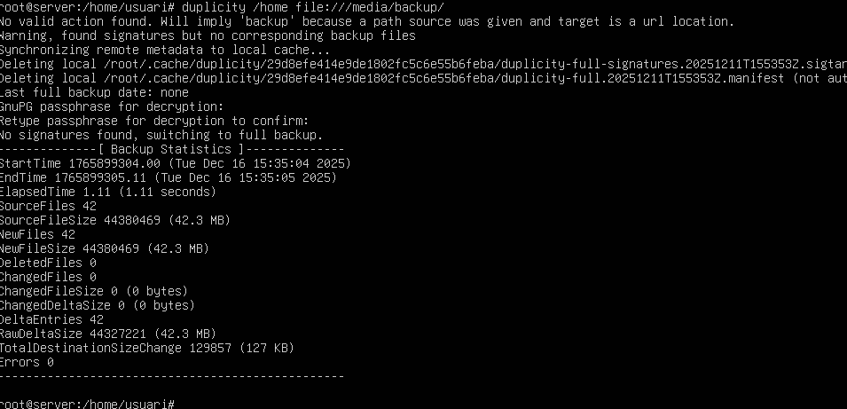

**Ara crearem un script per fer que les copies es facin soles**

```
umount /media/backup
```

**Crearem un arxiu**

```
sudo nano fullbackup.sh
```

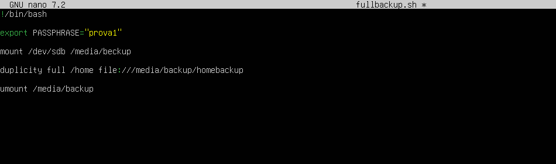


**Ara donem permisos**

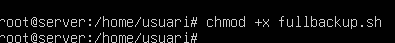


**Ara editarem l'arxiu crontab perque el script es fagi els diumenges a les 11 de la nit**

```
crontab -e
```

**Ho deixarem aixì**

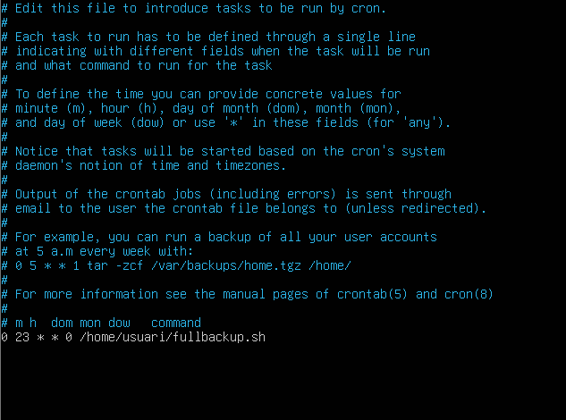

**Crearem un altre arxiu**

```
sudo nano incrementalbackup.sh
```

**I a dins escrivim això**

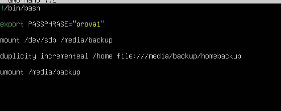

**I ara editem l'arxiu crontab així**

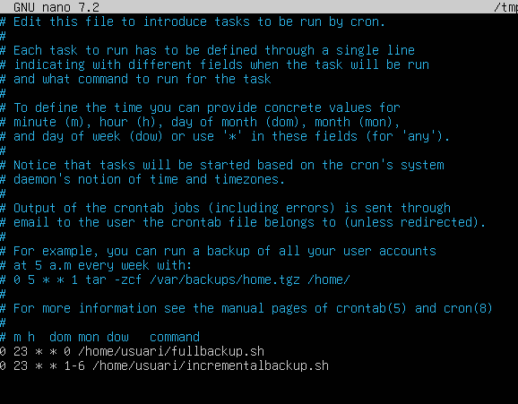