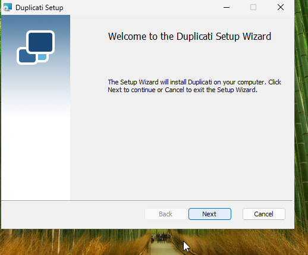
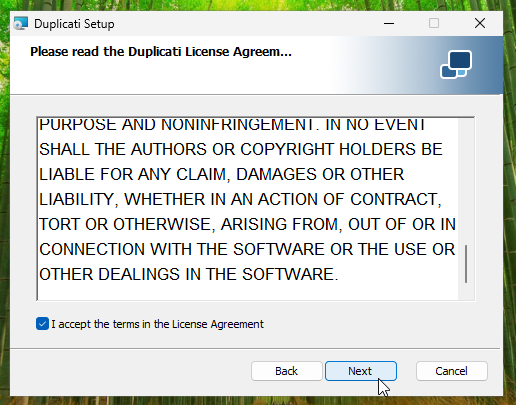
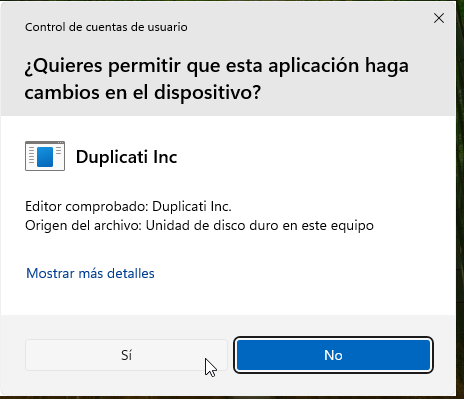
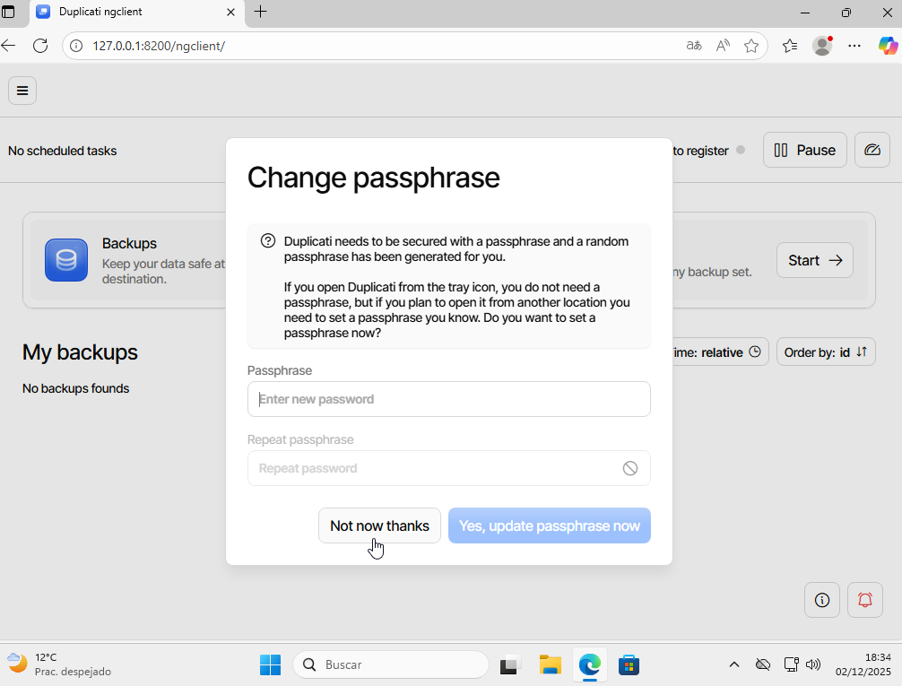

## TASCA 02 DPR: còpies de seguretat. Cas pràctic

**El primer pas serà entrar al nostre navegador i entrar a la Web de duplicati, seguidament instal·larem segons el nostre sistema operatiu, en aquest cas Windows**

**Un cop instal·lat obrim el descarregable i començem amb la instal·lació**

**Acceptem y continuem**

**Seguim amb la instal·lació com a les següents captures**

**Haurem de donar-li permisos per fer canvis al dispositiu**

**Esperem a que es completi**

**Un cop completat, li donarem a Finish**

**Al donar-li a finish ens obrirà una pàgina al nostre navegador, podrem canviar la contrasenya, però en aquest cas no la canviarem**

**Afagirem un backup**

**Ara posarem la informació del disc**

