**GUIA TASCA 05**

**Primer de tot instal·lem SSH**

```
sudo apt install ssh
```

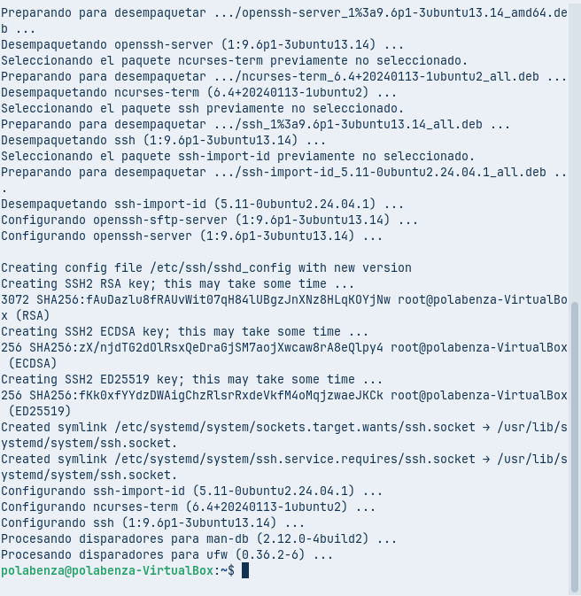

**Comprovem quina adreça té el server**

```
ip addr show
```

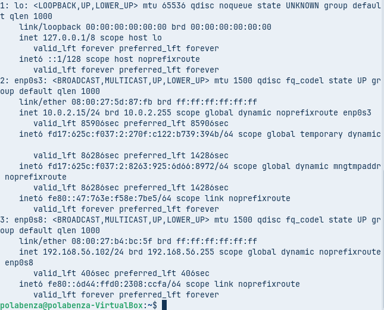

**Comprovem la connexió, desde Powershell**

```
ssh polabenza@192.168.56.102
```

***podem veure com tenim connexió desde windows com si estuguessim a Linux***

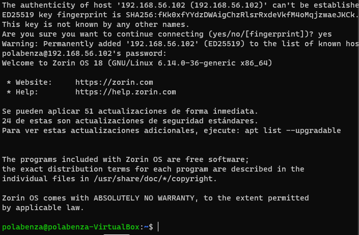


**Un cop que ja estem dins de la maquina el seguent pas que farem sera modificar l'arxiu de configuració, per poder editar-lo primer escriurem la seguent comanda**

```
sudo nano /etc/ssh/sshd_config
```

**Canviarem les següents lineas:**

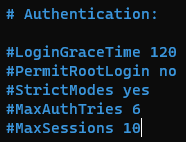


**Comprovem que només es pot iniciar sessió en root localment i no per SSH.**

```
sudo passwd root
```

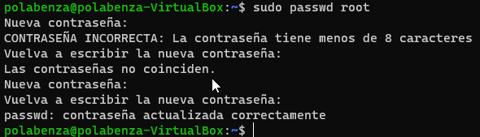


**Si fem SSH com a root, no ens deixara**

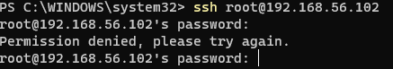


**Però podem iniciar sessió de manera local sense problemes**

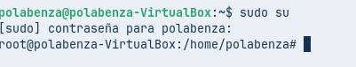


**Per donar connexió remota només a usuaris autoritzats crearem ara un nou usuari**

```
sudo useradd -m -s /bin/bash usuari2
```

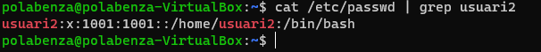

**Li posem una contrasenya a usuari2**

```
sudo passwd usuari2
```


**Afegim usuari autoritzat al arxiu SSH agefint la següent linia**

```
AllowUsers usuari
```


**Reiniciem el servei per aplicar els canvis**

```
sudo systemctl restart ssh
```

**Ara amb usuari si funciona pero amb usuari2 no**

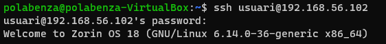

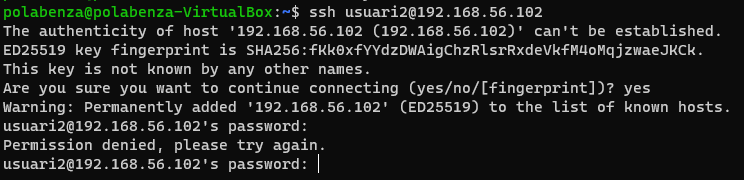


**Ara, accedirem amb un certificat en lloc d’haver de fer servir l’usuari i la contrasenya**

```
ssh-keygen -t rsa
```

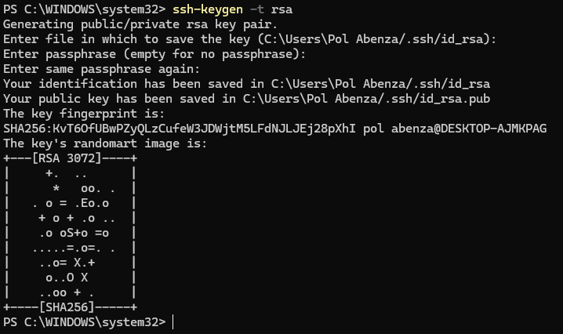


**Ara farem un ls**

```
ls .\.ssh
```

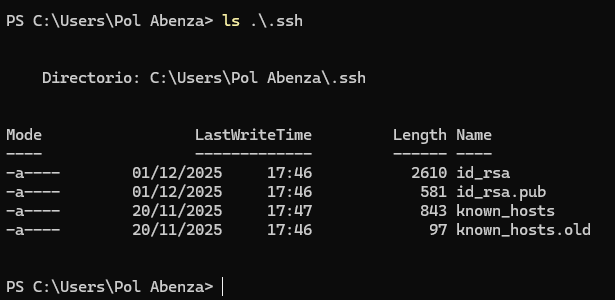


**I per ultim la seguent comanda sera**

```
scp .\.ssh\id_rsa.pub usuari@192.168.56.102:/home/usuari
```

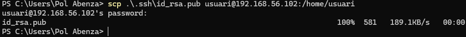


**A la nostra màquina Zorin creem el fitxer següent, que ha d’estar dins de la carpeta ssh. El creem amb la comanda següent**

```
touch .ssh/authorized_keys
```

**Ara copiem la clau id_rsa.pub dins del fitxer que vam crear amb la comanda anterior**

```
cat id_rsa.pub >> .ssh/authorized_keys
```

**Ara, des de la màquina Windows, fem ssh + el nom de la màquina Zorin —en el meu cas és usuari + IP— per comprovar que ens podem connectar a la màquina Zorin sense que ens demani la contrasenya**

```
ssh usuari@192.168.56.102
```

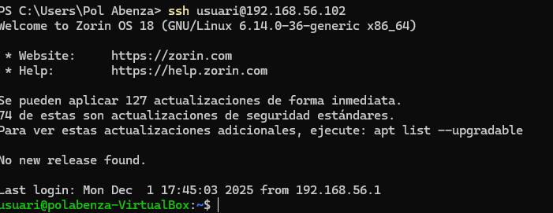


**Entrem a la configuració de Windows 11 i a sistemes**

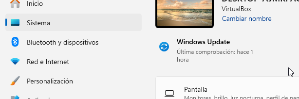


**Entrem  a característiques opcionales i li donem a ver características i li donarem a que si  per a que l'aplicació fagi canvis al dispositiu**

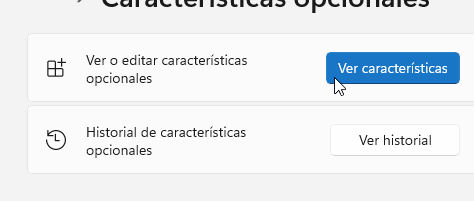

**Un cop a dins li donem a ver características disponibles, busquem Servidor OpenSSH marquem la casilla, l'agreguem i esperem a que s'agregui correctament**


**Per connectar-nos remotament, primer revisem la configuració del tallafoc de Windows 11 a Firewall i protecció de xarxa, ajustant la xarxa pública si és necessari**

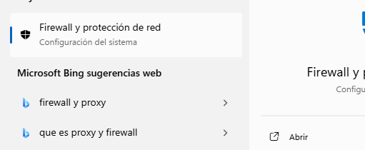

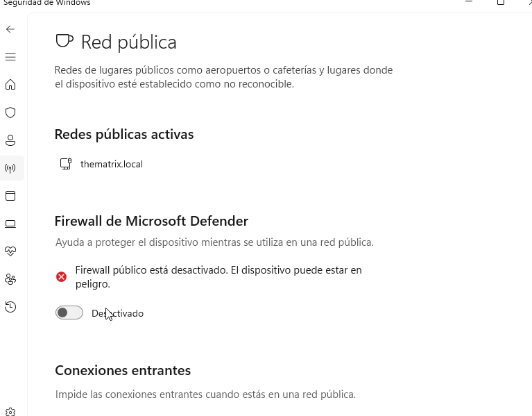

**Ara executem Windows Powershell com administrador**

**Un cop iniciat engeguem el servei SSH**

```
Start-Service ssh
```

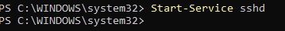

**Fem que cada cop que engeguem la màquina s'activi el servei**

```
Set-Service -Name sshd -StartupType "Automatic"
```

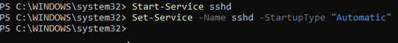


**Per acabar fem ipconfig desde el powershell  per veure la IP**

```
ipconfig
```

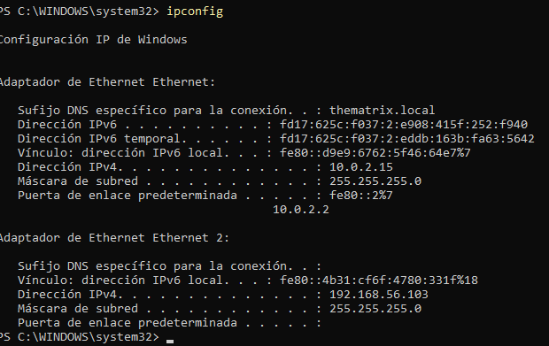

**Des de la màquina Zorin ens connectem a la màquina Windows amb la IP de la interfície de només amfitrió de la màquina Windows**

**Primer fem un ping des de la màquina Zorin per comprovar que ambdues màquines es poden veure. El ping seria: ping + la IP de només amfitrió de la màquina Windows**

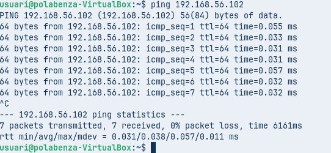


**Una vegada comprobat que les dos maquines es veuen ara ens podem connectar desde la màquina Zorin a la de Windows.**

```
ssh usuari@192.168.56.102
```

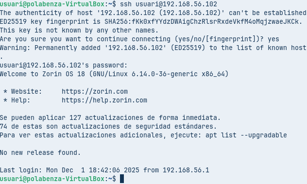