## TASCA 06

**Primer de tot a la nostra màquina Windows obrirem Configuración de Escritorio Remoto**

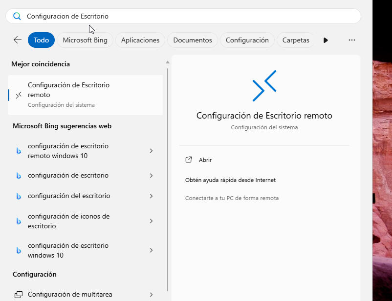

**Activem l'opció de Escritorio Remoto**

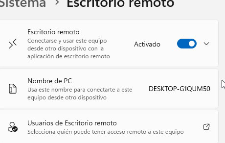

## Ara Configurarem la màquina Zorin

**Haurem d'anar a configuració i remote desktop**

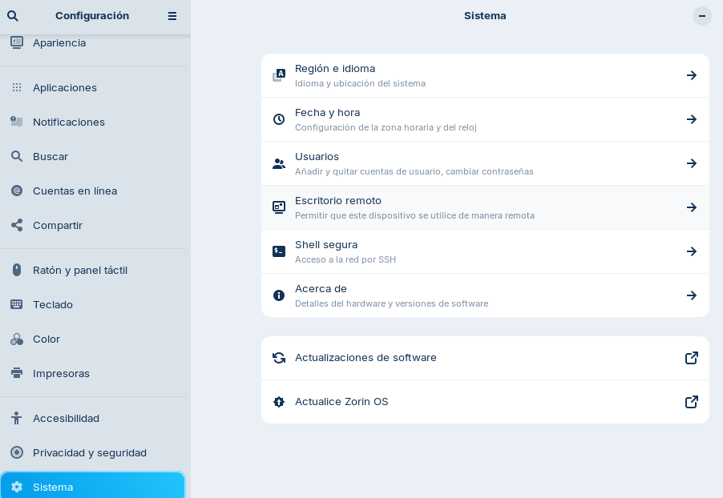

**Activem l'opció de Desktop Sharing i Remote Control**

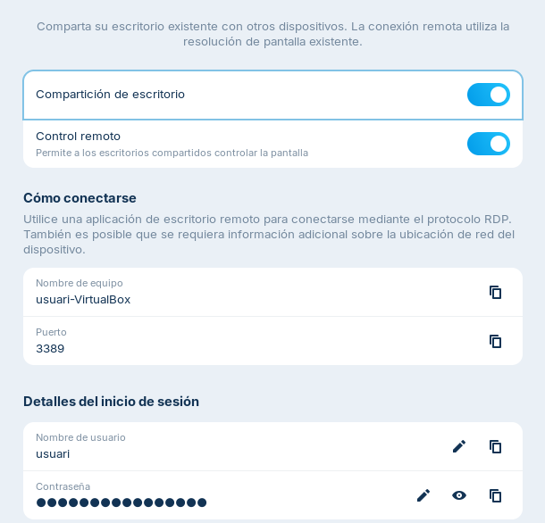

**També canviem la contrasenya**

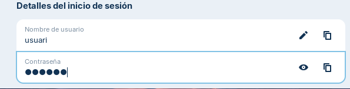

**A la màquina Windows obrirem Conexion a Escritorio Remoto**

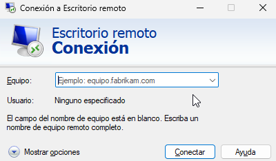

**Posarem la IP de la màquina Zorin**

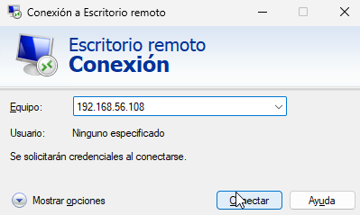

**Posarem les credencials**

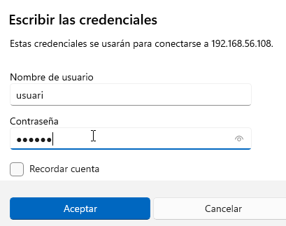

**A aquesta advertencia li direm que si**

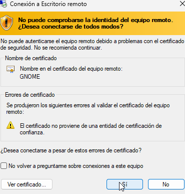

**Aqui veiem com estem ja connectats**

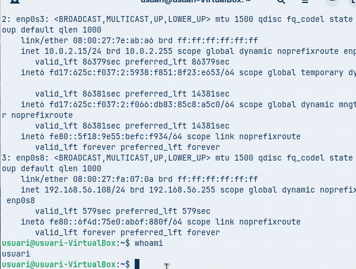

## Ara ens connectem desde la màquina Zorin a Windows

**Obrirem Remmina**

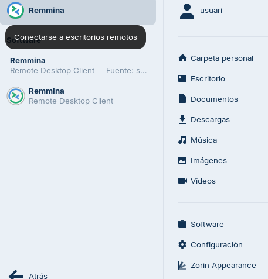

**Posem la IP de la màquina Windows**

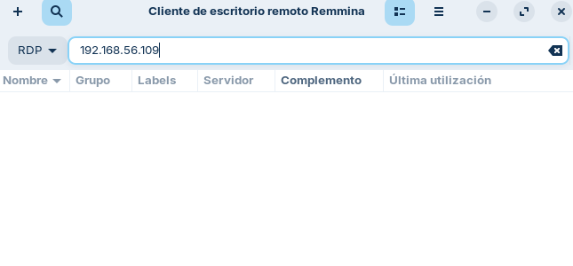

**Li diem que sí a la Advertencia**

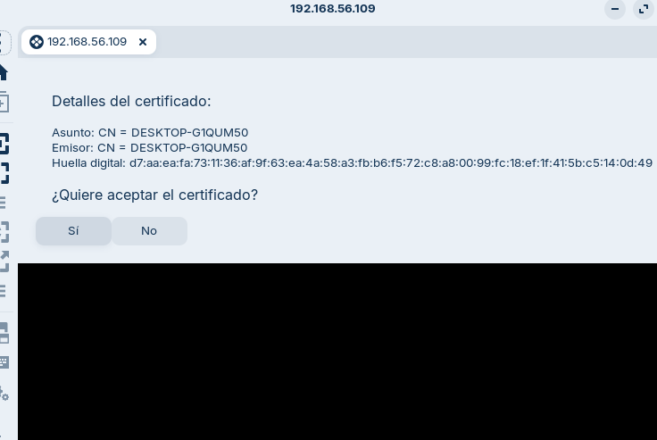

**Posem credencials**

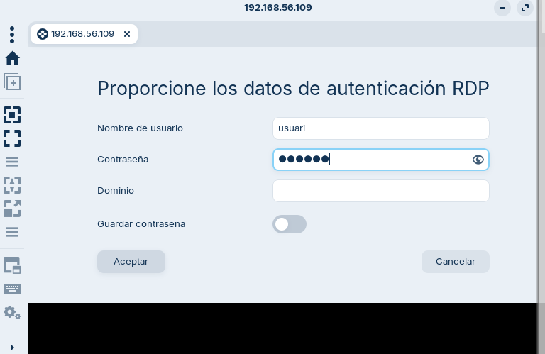

**I ja estarem a l'escritori de Windows**

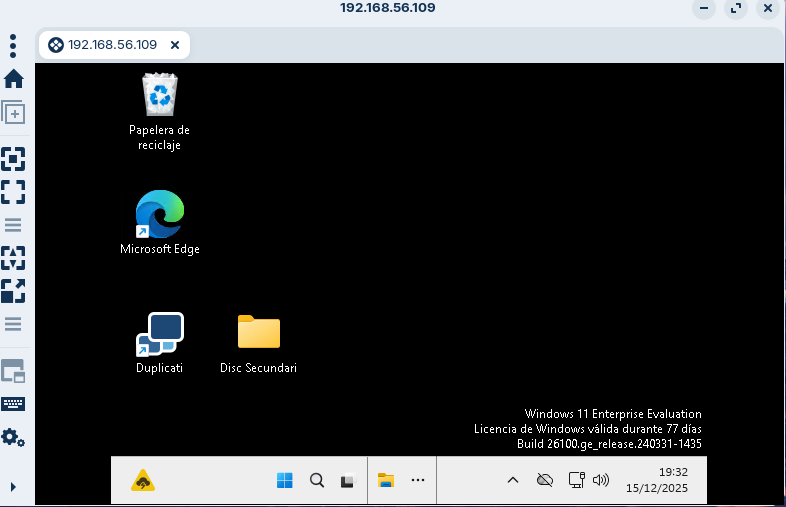