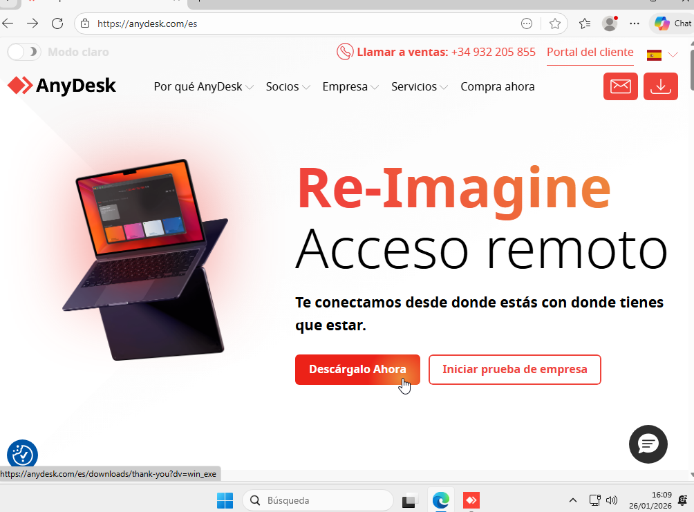
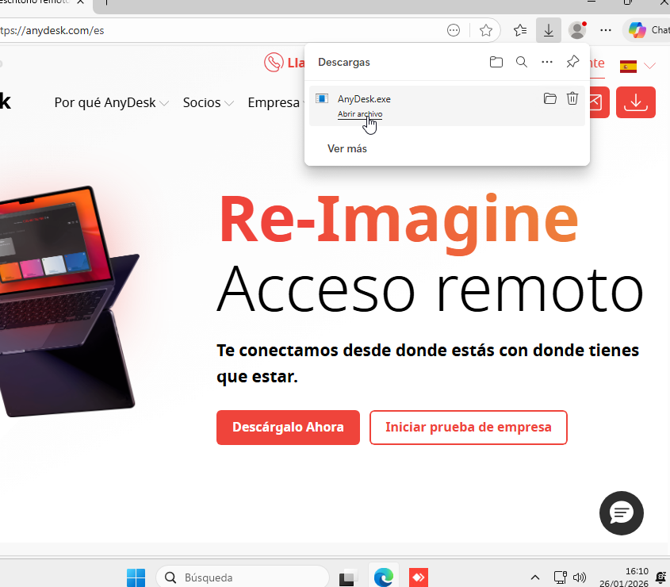
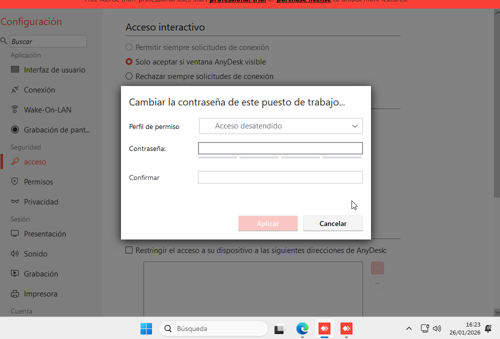
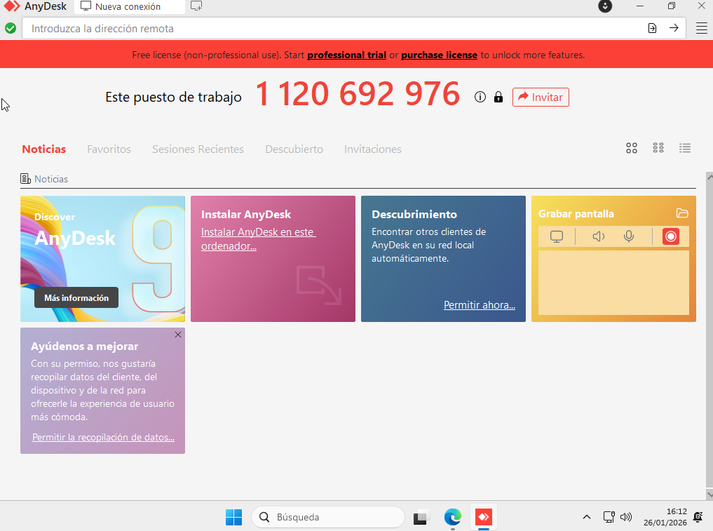
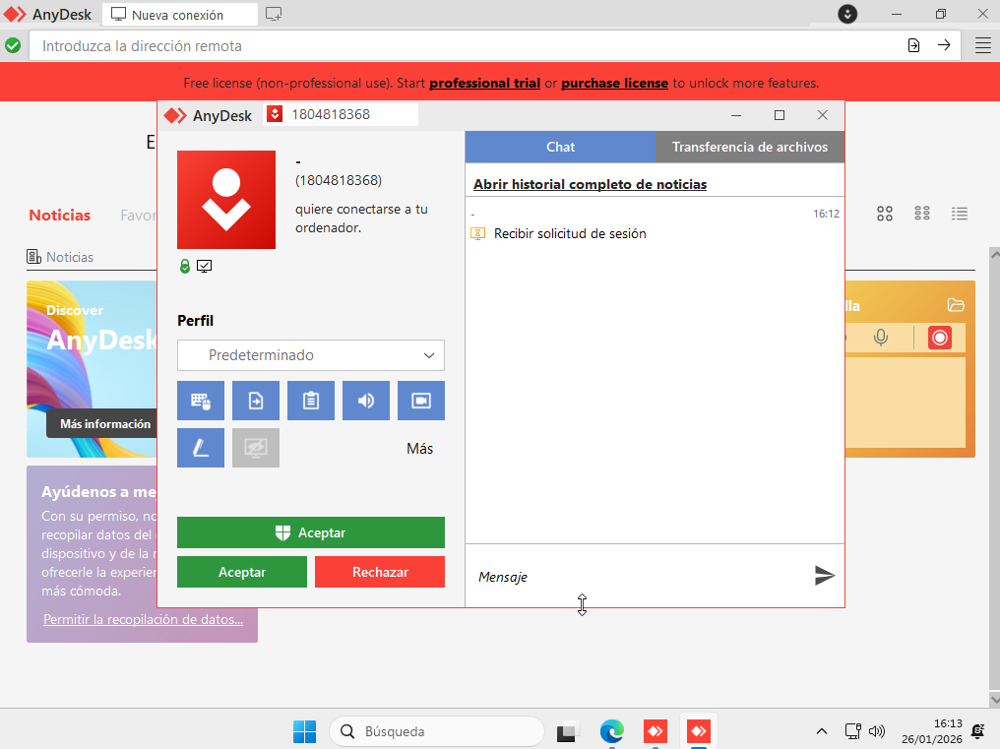
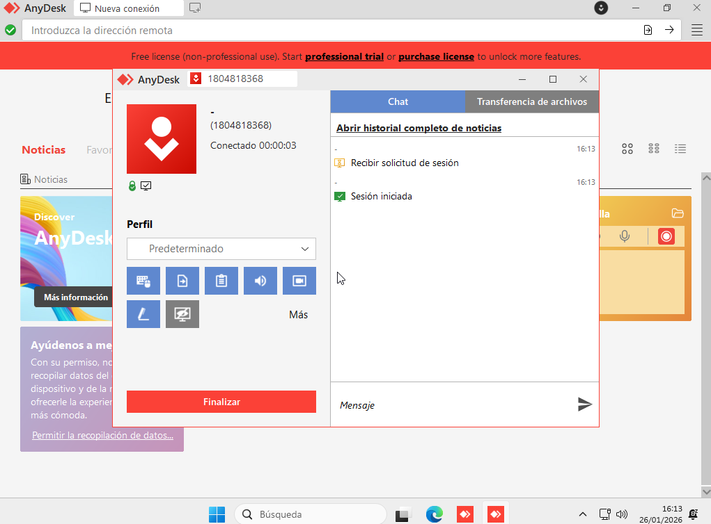

# Manual per al Client

Aquesta guia mostra com utilitzar **AnyDesk** per rebre assistència remota. Inclou els següents punts:

- Com obtenir i executar el mòdul **Quick Support** (o equivalent) sense necessitat d’instal·lació.
- On fer clic exactament per iniciar el procés.
- Com localitzar i comunicar al tècnic l’**ID de sessió** i la **contrassenya** (si és necessària).
- Com acceptar la sol·licitud de connexió del tècnic.

## Pas 1: Obtenció d’AnyDesk

**Per descarregar AnyDesk, podem cercar “AnyDesk” al navegador o accedir directament a l’enllaç oficial. Un cop dins, cal fer clic al botó principal indicat com a **“Descàrrega ara”** per obtenir el mòdul **Quick Support**, que no requereix instal·lació i permet iniciar la sessió de manera ràpida.**

**Ara farem click a la finestra de descàrregues que està a la part de adalt a la dreta, allà tindrem el instal¨lador de AnyDesk.**

**Un cop a dins a configuració podem canviar la contrasenya perque aixì no entri ningú que no volguem**

**Li haurem de dir al tècninc el codig que ens surt al mig de la pantalla**

**Un cop li diem el tècnic es conectarà a nosaltres i ens surtirà el següent avís, un cop ens assegurem de que és la persona que volem ho acceptem**

**Ara ja el tècinc tindría accés al nostre ordinador**

