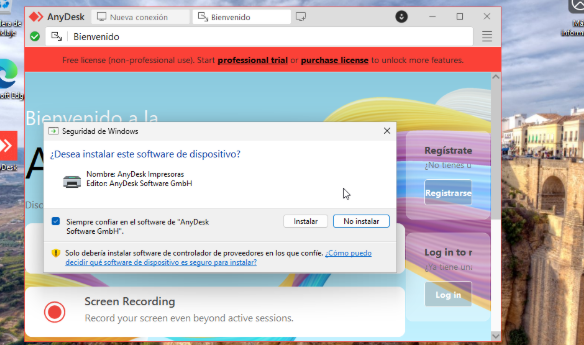
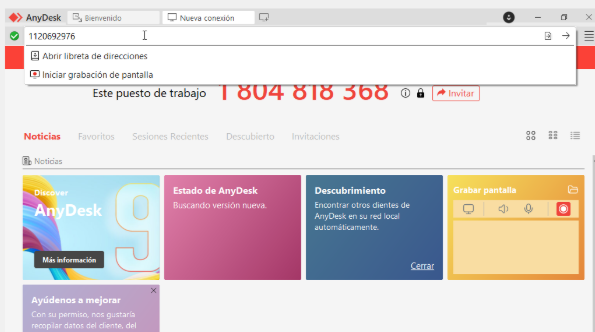
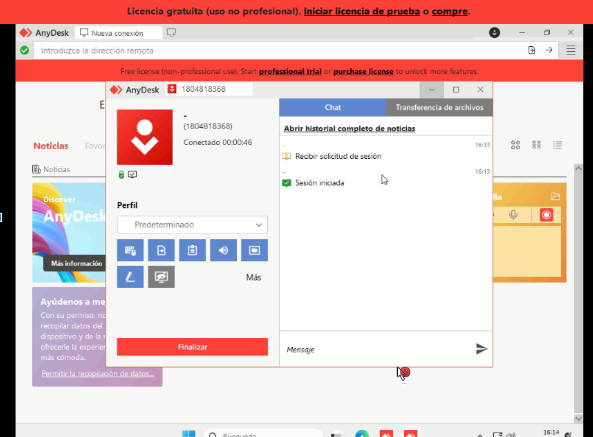
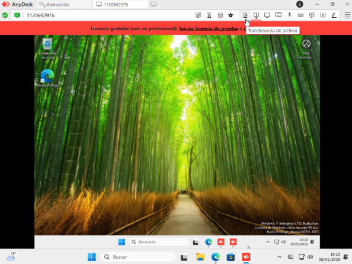
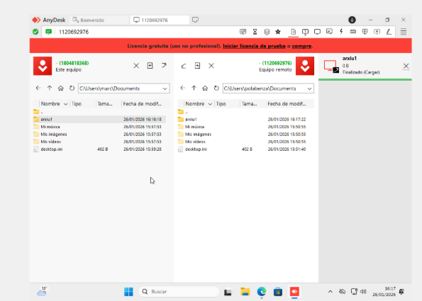
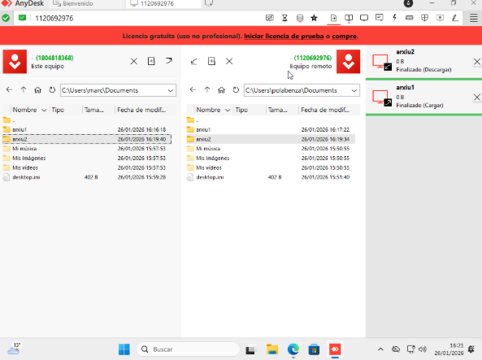
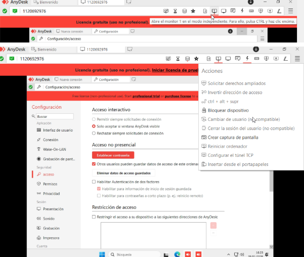
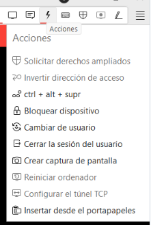

# Manual per al Tècnic

Aquesta guia mostra com utilitzar **AnyDesk** des del punt de vista del tècnic i inclou les principals funcionalitats i bones pràctiques:

- **Instal·lació de la versió completa/tècnica**: Pasos per descarregar i configurar AnyDesk per a ús professional.  
- **Inici d’una sessió de suport**: Com connectar-se a l’equip del client de manera ràpida i segura.  
- **Gestió de funcions principals**: Inclou transferència de fitxers, canvi de pantalla, reinici remot i altres eines útils durant la sessió.  
- **Recomanacions de seguretat**: Bones pràctiques com tancar sempre la sessió després de finalitzar, no desar contrasenyes dels clients i mantenir la connexió segura.

**El primer pas és instal·lar el Any Desk**

**Un cop instal·lat a dalt a la dreta ens surtirà el instal·lador**

**Per continuar, cal executar l'aplicació. Inicialment s’obrirà una versió **portable**, que no requereix instal·lació. Com que en aquest cas volem instal·lar-la al sistema, cal fer clic a l'opció indicada com a **“Instal·lar AnyDesk en aquest ordinador”**.**

**Li donarem a instal·lar**

**Per continuar haurem de posar el codig del client a dalt de la pantalla**

**Haurem d'esperar a que el client accepti la petició, quan l'accepti ja estariem dins**

**Anirem al següent icono de la pantalla a dalt a la dreta per fer una transferència d'arxius**

**Creem un arxiu a l'ordinador del tècnic i ho podem passar al ordinador del client**

**També podem passar arxius del ordinador del client a l'ordinador del tècnic**

**Podriem canviar de pantalles si el client té més d'una, en aquest cas no tenim més de una pero sortirien les pantalles que el client tingués**

## Bones pràctiques de seguretat

Per finalitzar, cal seguir alguns protocols per garantir la **privacitat del client** durant les sessions remotes:

1. **Consentiment del client**  
   Abans de connectar-nos, hem d’assegurar-nos que el client està d’acord amb l’accés al seu ordinador.

2. **No desar contrasenyes**  
   Les contrasenyes del client són exclusives. Si en algun moment ens les proporciona per resoldre una incidència, **no hem de compartir-les ni emmagatzemar-les** al nostre equip.

3. **Tancar la sessió al finalitzar**  
   Sempre hem de tancar la sessió un cop resolta la incidència. Això evita que continuem veient la pantalla del client sense el seu coneixement i garanteix que la connexió s’acabi correctament.  
   Per tancar la sessió, simplement cal fer clic a la **creu situada a la part superior esquerra** de la finestra de l’aplicació.

