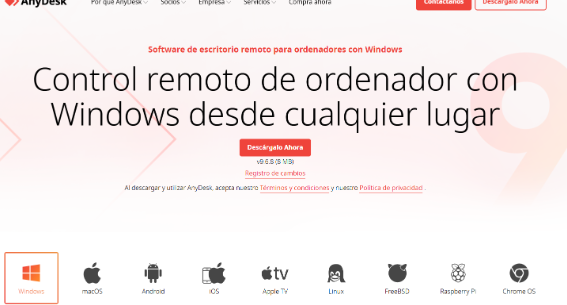
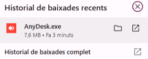
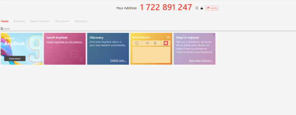

# Manual per al Tècnic

Aquesta guia mostra com utilitzar **AnyDesk** des del punt de vista del tècnic i inclou les principals funcionalitats i bones pràctiques:

- **Instal·lació de la versió completa/tècnica**: Pasos per descarregar i configurar AnyDesk per a ús professional.  
- **Inici d’una sessió de suport**: Com connectar-se a l’equip del client de manera ràpida i segura.  
- **Gestió de funcions principals**: Inclou transferència de fitxers, canvi de pantalla, reinici remot i altres eines útils durant la sessió.  
- **Recomanacions de seguretat**: Bones pràctiques com tancar sempre la sessió després de finalitzar, no desar contrasenyes dels clients i mantenir la connexió segura.

**El primer pas és instal·lar el Any Desk**

**Un cop instal·lat a dalt a la dreta ens surtirà el instal·lador**

**Per continuar, cal executar l'aplicació. Inicialment s’obrirà una versió **portable**, que no requereix instal·lació. Com que en aquest cas volem instal·lar-la al sistema, cal fer clic a l'opció indicada com a **“Instal·lar AnyDesk en aquest ordinador”**.**

