## TASCA 09 Servidor fitxers Linux. NFS

**Per començar aquesta pràctica crearem 2 màquines virtuals de Linux, una amb Ubuntu i l'altre amb Zorin**

**Per començar crearem dos grups**

```
sudo groupadd devs && sudo groupadd admins
```


**El següent pas serà crear els usuaris i afegir-los al grup corresponent**

```
sudo useradd -m -s /bin/bash -G devs dev01
```

```
sudo useradd -m -s /bin/bash -G admins admin01
```


**Ara crearem els directoris per als projectes de desenvolupament i les eines d'administració**

```
sudo mkdir -pv /srv/nfs/dev_projects
```


```
sudo mkdir -pv /srv/nfs/admin_tools
```


**Aqui podem veure els permisos de cada grup i a que poden accedir**


```
chmod 770 /srv/nfs/dev_projects
```

```
chmod 770 /srv/nfs/admin_tools
```

**Ara a la màquina Zorin que es la del client haurem de crear usuaris i grups amb l'aplicació Users and Groups**

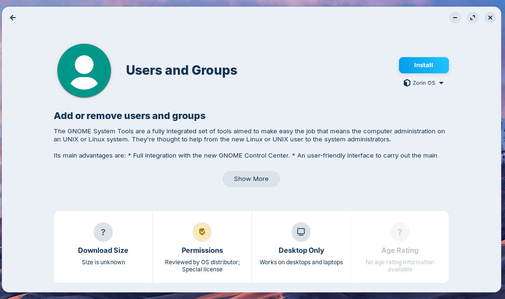

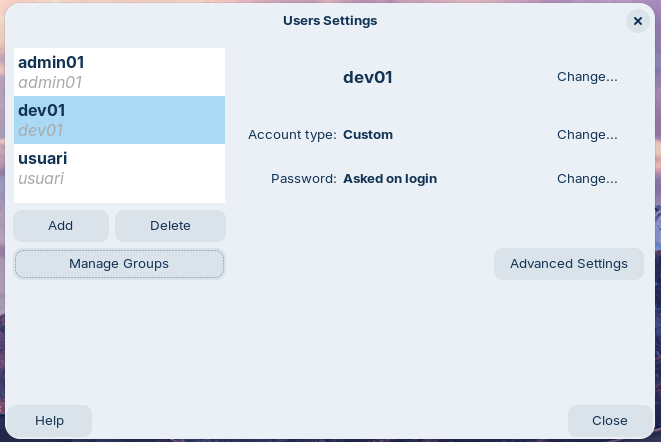


**Un cop configurat instal·larem nfs**

```
apt install nfs-kernel-server -y
```

Per comprobar que s'ha instalat correctament podem fer un systemctl status

```
systemctl status nfs-kernel-server
```

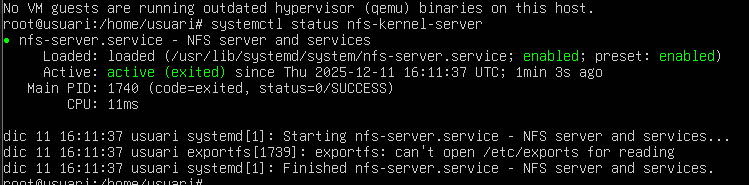


**Editarem l'arxiu /etc/exports per decidir quants arxius exportar, afegirem una linia adicional al final del arxiu**

```
/srv/nfs *(rw,sync,no_subtree_check)
```

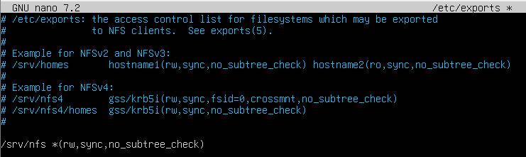

**Per aplicar els canvis fem el següent**

```
systemctl restart nfs-kernel-server
```

**Ara mirarem que funcioni bé tot**

```
exportfs -u
```

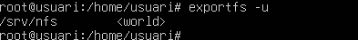

**Tambe podem fer la seguent comanda per veure des-de quin port treballa**

```
rpcinfo -p 192.168.56.104
```

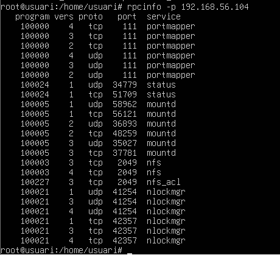

**Ara haurem d'instalar el paquet nfs-common**

```
sudo apt install nfs-common -y
```

**Ara ens conectarem al servidor amb la comanda showmount -e IP**

```
showmount -e 192.168.56.104
```

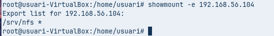

**Havent exportat /srv/nfs, ara només queda muntar-lo a /mnt/admin_tools. Com que aquest directori no hi és encara, l’hem de crear abans. Ho fem amb la comanda següent**

```
mkdir /mnt/admin_tools 
```


**Ara muntarem el recurs**

```
mount -t nfs 192.168.56.101:/srv/nfs/admin_tools /mnt/admin_tools
```

**Creem un arxiu desde dev01**

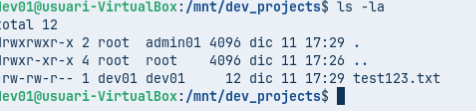

**Ara canviem la IP per comprovar que ens deixa llegir**

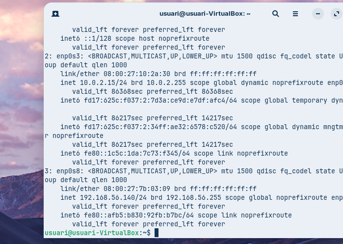

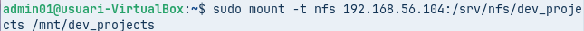

**Ara no ens deixa**

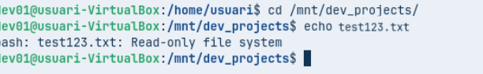

**Ara configurem l'arxiu fstab**

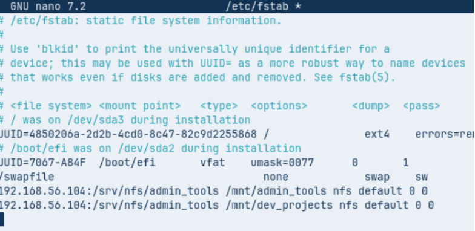

**Ara reiniciem el daemon**


**Fem Mount -a**

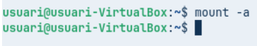


