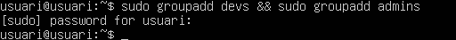
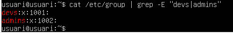
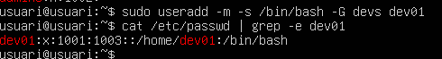
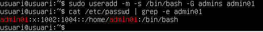
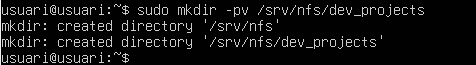
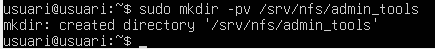

## TASCA 09 Servidor fitxers Linux. NFS

**Per començar aquesta pràctica crearem 2 màquines virtuals de Linux, una amb Ubuntu i l'altre amb Zorin**

**Per començcar crearem dos grups**

```
sudo groupadd devs && sudo groupadd admins
```






**El següent pas serà crear els usuaris i afegir-los al grup corresponent**

```
sudo useradd -m -s /bin/bash -G devs dev01
```

```
sudo useradd -m -s /bin/bash -G admins admin01
```





**Ara crearem els directoris per als projectes de desenvolupament i les eines d'administració**

```
sudo mkdir -pv /srv/nfs/dev_projects
```



```
sudo mkdir -pv /srv/nfs/admin_tools
```




**Aqui podem veure els permisos de cada grup i a que poden accedir**


